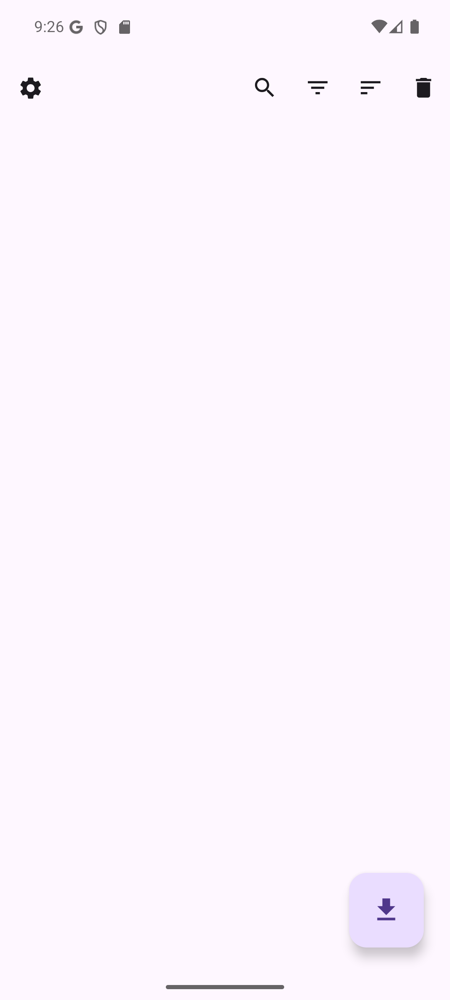
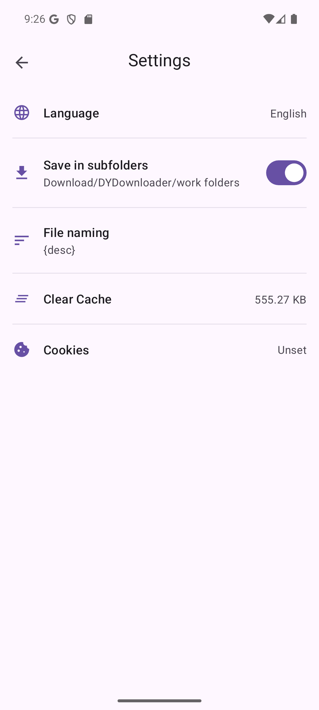
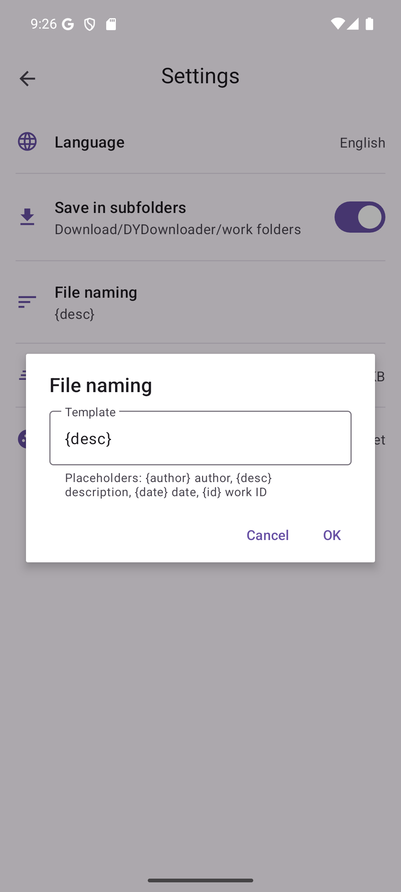

# DYDownloader

[简体中文](README.md)

  

DYDownloader is a fully open-source and free Android app for downloading watermark-free Douyin/TikTok original images, albums, live photos, videos, account posts, and collection posts.

## Screenshots

  
  
  
  

## Features

- Download watermark-free Douyin/TikTok original images, albums, live photos, videos, work, account, and collection.
- Use local parsing plus official Douyin/TikTok interfaces, with no third-party parsing platforms or relay services

## Cookies

Some parsing and download flows require Cookies.

- Set Cookies manually: `Settings -> Cookies -> Log in to Douyin/TikTok`
- Cookie data is stored locally on the device only and is attached only when requesting Douyin/TikTok and never uploaded to any third-party platform or service

## Disclaimer

- This project is for learning, research, and lawful personal use only
- Make sure you comply with local laws, platform rules, and copyright requirements and do not use this project for infringement, unauthorized redistribution, bulk scraping, or any illegal or abusive activity
